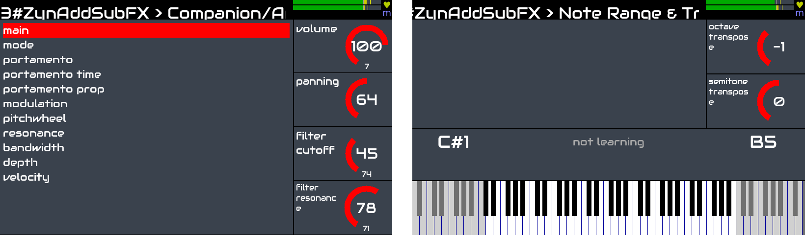
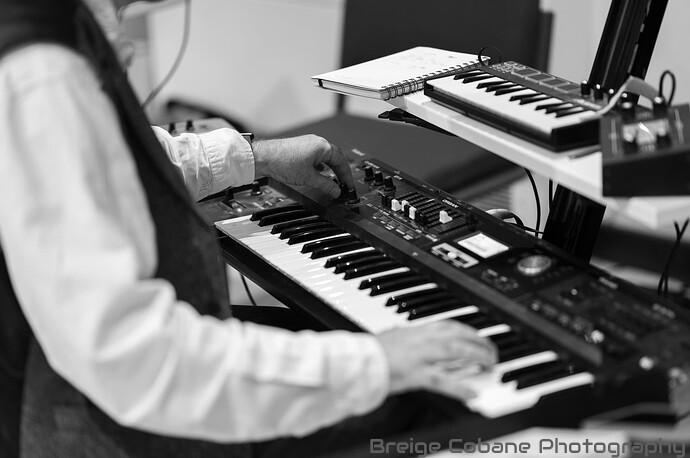

Zynthian is a great tool for keyboardist wanting to expand their playing possibilities without having to carry heavy and expensive hardware.

Zynthian includes more than 30 synth-engines, hundreds of effects and thousands of presets. You can play the music style you want, recreating vintage instruments or exploring new sounds and textures. You can combine several engines and presets, adjust synth parameters and add effects and filters.

[figure class=""][/figure]

Zynthian supports the LV2 plugin-format, so the list of synth-engines & effects is ever growing. The amazing (but non-free) [Pianoteq](https://www.modartt.com/pianoteq?target=_blank) physical modeller is also supported and a demo version is included.

The MIDI-learning workflow is quick & easy, allowing you to manage everything from your keyboards/controllers.  Buttons can be assigned to presets (program-change), knobs & faders, to engine parameters (CC).

The **Stage Mode** has been designed for players who like to use a single master keyboard. Fast preset changes and smooth transitions. No cut sounds. You start playing a new preset while the last notes from the old one are still releasing. Keep some notes pressed or sustained while changing to a new preset and the notes will continue to sound until you release the key/pedal.

[figure class=""][/figure]

Of course, you can use the **Multitimbral Mode**, connecting several keyboards and controllers. Zynthian has standard MIDI-IN/THRU/OUT connectors and 4 USB ports ([full specifications](/technical-specifications)). In **Multitimbral Mode** every layer is controlled by a MIDI channel. You can configure every keyboard to play a different layer. Or you may want a step-sequencer controlling the Drum & Bass line while you play a lead ...

The _MIDI-clone_ feature is the key to combining several layers for creating layered sounds whilst keeping independent control over the parameters you want. You can transpose layers or split the keyboard using the MIDI filter.

The web configuration tool allows you to add new presets, manage your snaphot library, download your recordings and much more! You can also configure your zynthian to be totally controlled from your keyboard. Every UI action can be mapped to MIDI events.

Default latency and jitter is low enough for most players, but if you are looking for extra-low latency, audio configuration can be tweaked too.