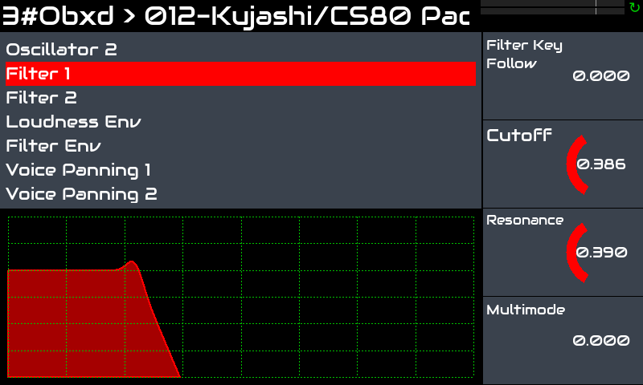
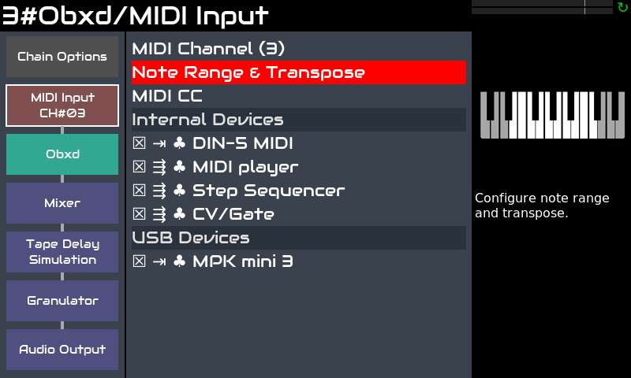

Zynthian is a great tool for keyboardist wanting to expand their playing possibilities without having to carry heavy and expensive hardware.

Zynthian includes more than 30 synth-engines, hundreds of effects and thousands of presets. You can play the music style you want, recreating vintage instruments or exploring new sounds and textures. You can combine several engines and presets, adjust synth parameters and add effects and filters.

[figure class=""][/figure]

Zynthian supports the LV2 plugin-format, so the list of synth-engines & effects is ever growing. Most of the available plugins are free software, but some commercial plugins are available, like the amazing [Pianoteq](https://www.modartt.com/pianoteq?target=_blank) physical modeller or TAL-U-NO-LX, an accurate JUNO-60 emulator. Demo versions are included for both of them.

You can easily combine several chains (instruments) to create layered sounds whilst keeping independent control over the parameters you want. You can transpose each one independently and split the keyboard as you like. 

[figure class=""][/figure]

Each MIDI controller (keyboard, etc.) you connect to zynthian can be routed to any number of chains and configured to work in **active** or **multi** mode. **Active** is the default. In **active** mode, the selected chain (active) receives the notes you play, **no matters the MIDI channel**. In the other hand, **multi** mode allows you to **take profit of MIDI channels**, allowing different chains to receive different MIDI channels.

Sub-snapshots (ZS3s) allow fast preset changes and smooth transitions between instruments. No sound cut when changing instrument. You start playing a new preset while the last notes from the old one are still releasing. Keep some notes pressed or sustained while changing to a new preset and the notes will continue to sound until you release the key/pedal. 

The MIDI-learning workflow is quick & easy, allowing you to manage everything from your keyboards/controllers.  Buttons can be assigned to presets (program-change), knobs & faders, to engine parameters (CC).

[figure class=""][/figure]

Zynthian has standard MIDI-IN/THRU/OUT connectors and 4 USB ports ([full specifications](/technical-specifications)). You can configure each keyboard to play a different chain. Or split your keyboard and map several instruments on it. Or you may want the step-sequencer controlling the Drum & Bass line while you play a lead. Possibilities are almost endless ...

The web configuration tool allows you to install collections, manage your presets, soundfonts and snapshots, download your recordings and much more! You can also configure your zynthian to be totally controlled from your keyboard. Every UI action can be mapped to MIDI events.

Regarding latency and jitter, the default configuration (<10ms) is enough for most players, but if you are looking for extra-low latency, audio configuration can be tweaked.
