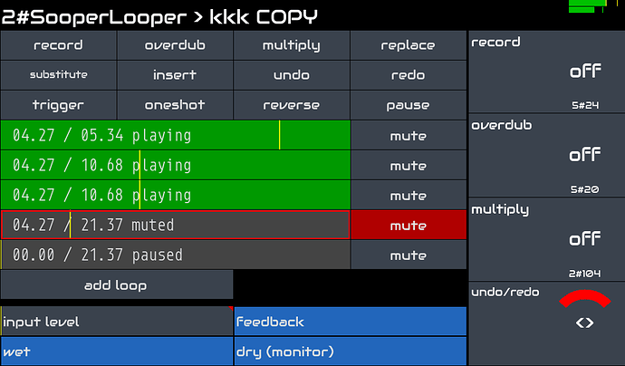

Zynthian can be used as a powerful Audio Effects unit allowing creation of a customized effect-chain for every available audio input.

The official Zynthian V5 Kit have 2 balanced audio-inputs with independent gain-control ranging from -12db to +32dB. Read the full specifications [here](/technical-specifications). You can directly connect a wide rage of input devices, like dynamic microphones, electric & acoustic guitars, piezos, line-in, etc. If you need more audio inputs, you simply connect your favorite USB audio interface and get all the extra audio input/output channels you need.

Zynthian supports the LV2-plugin standard and includes hundreds of audio-processing plugins. You can combine them as you like for sculpting the sound, recreating vintage landscapes or exploring new textures. You can have any number of FX-chains with flexible routing allowing as simple or complex configuration as desired.

If you are a guitar guy, you will enjoy the 3 neural modelers included with zynthian:

+ [Aida-X](/engines/_engine-list/engine-aidax)
+ [NAM](/engines/_engine-list/engine-nam)
+ [Ratatouille](/engines/_engine-list/engine-ratatouille)

They bring state-of-the-art, accurate emulation of analog gear like amplifiers, distortion, fuzz, overdrive stomp-boxes, etc. Literally thousands of models are freely available in places like [ToneHunt](https://tonehunt.org). Simply download your favorite gear model and get the tone you love.

If you like looping, Sooper Looper is fully integrated, allowing to control up to 6 independent loops with instant record, overdub, reverse, multiply, replace, time-stretch, pitch-shift, and much more.

[figure class=""][/figure]

The MIDI-learning workflow is quick & easy. You can adjust the parameters you want from your favorite MIDI controller. Buttons can be assigned to presets (program-change), and knobs/faders to parameters (CC).

Regarding latency and jitter, the default configuration (<10ms) is enough for most players, but if you are looking for extra-low latency, audio configuration can be tweaked.
