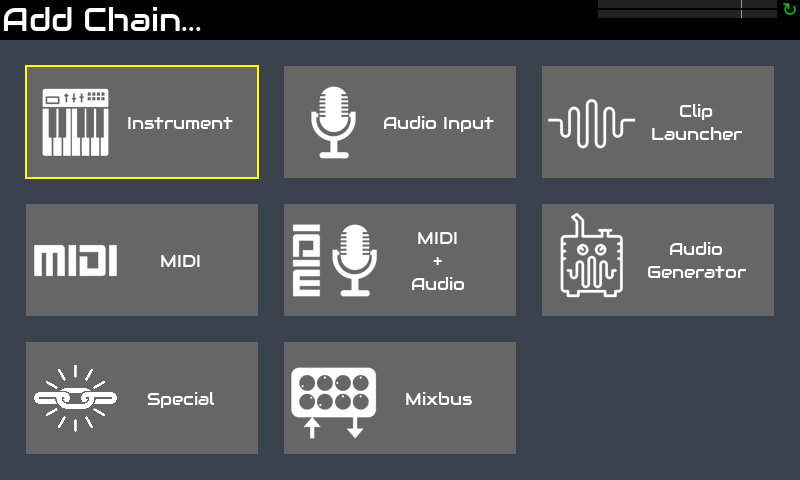
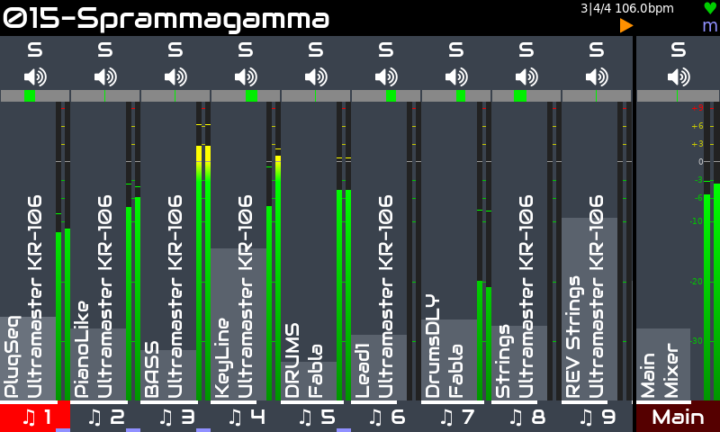
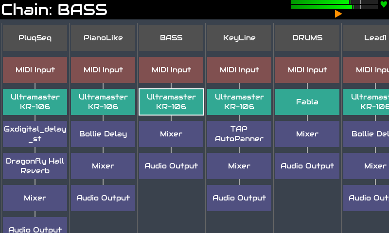
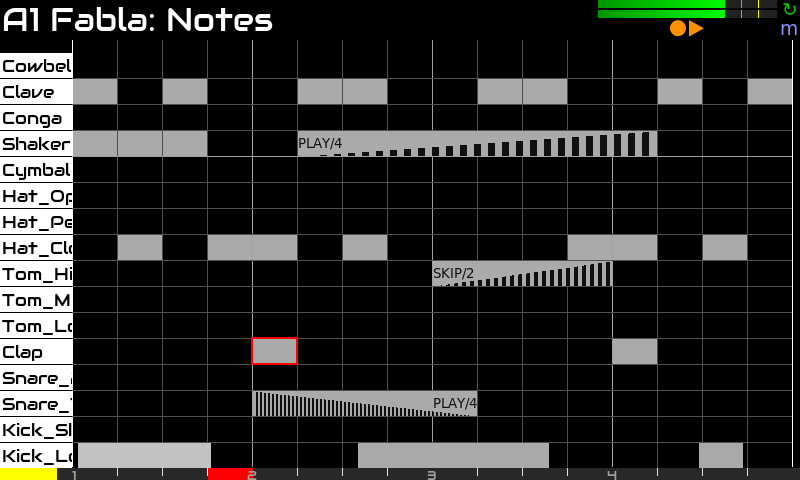
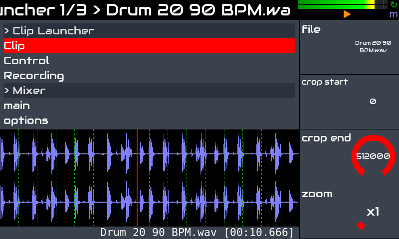
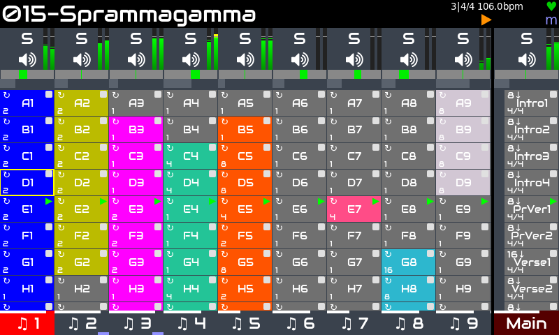

Zynthian is also a powerful tool for production. It includes more than 30 synth-engines, hundreds of effects and thousands of presets.

[figure class=""][/figure]

It's fully multitimbral, being able to manage up to 16 instrument chains and any number of audio effects, midi processors and mixbuses. It supports the LV2-plugin standard, so the list of available processors is huge and ever growing.

[figure class=""][/figure]
[figure class=""][/figure]

It features a powerful step-sequencer with live-performing and song-composing features:

+ high resolution (1920 ppqn)
+ pattern editor (events & blocks)
+ copy/paste & transpose blocks
+ copy/paste patterns
+ live capture
+ undo/redo
+ advanced stutter options:  speed, duration, volume-fade, speed-ramp
+ repeat & randomization options: play/skip chance, play/skip frequency, etc. 
+ parameter automation
+ much more!

[figure class=""][/figure]

It also features an advanced audio clip player capable of loading any audio file format, time-stretch and synchronize audio samples, etc.

[figure class=""][/figure]

The launcher view allows to combine step sequencer patterns and audio clips, starting and stopping them in a synced way, allowing different modes  for one-time, loops, etc. Phrases allows you to structure your songs, automating tempo & time signature changes, defining loops and CODA sections, etc.

[figure class=""][/figure]

A growing list of midi controllers are supported and can be used to control zynthian without extra configuration, totally plug & play:

+ **Novation:** LaunchPad Mini / Pro / X. LaunchKey Mini, etc.
+ **Akai:** APC Key-25, APC 40, MPK mini, MIDI Mix
+ **Korg:** nanoKONTROL
+ **Behringer:** Motör 61 / 49
+ **Arturia:** Keylab 61
+ **Teenage Engeneering:** OP1
+ **Worlde:** Mini
+ **Foxtex:** Mixtab
+ **Mackie (MCU)**
+ etc.

[Here](https://wiki.zynthian.org/index.php/Supported_MIDI_controllers) you can check the list of supported MIDI controllers. 

Zynthian can also be controlled from DAWs and external sequencers. It's plenty of connection options:

+ legacy MIDI DIN-5 connectors (IN / OUT / THRU)
+ 4 x USB-A ports (host)
+ 1 x USB-B ports (device)
+ Ethernet and WIFI network connectivity
  
Supporting several _MIDI over network_ protocols:

+ NetUMP (MIDI 2.0)
+ RTP (Apple MIDI)
+ QMidiNet (IP-multicast)
+ TouchOSC (tablet as MIDI controller)
+ etc.

And there is a lot more:

+ easy midi-learning with value range and scaling
+ flexible audio & midi routing
+ mixbuses
+ multi-track audio recorder
+ midi recorder and player
+ rule-based midi-filter
+ PureData & Organelle patches
+ MOD-UI integration

Regarding latency and jitter, the default configuration (<10ms) is enough for most players, but if you are looking for extra-low latency, audio configuration can be tweaked.

Read the full specifications [here](/technical-specifications).

<!--
<small>Trip Jazz Demo, by Humi</small>

<small>BlueBox is Roughly Great, by Nicolaz</small>

<small>RTPMidi Celebration, by JTunes</small>

<small>Epic EnteR, by R.Generalov</small>

<small>Electro, by Humi</small>

<small>Mr Tchaikovsky, by sm7x7</small>

<small>Of Course My Lord, by R.Generalov</small>

<small>First Real Synth, by Can Trell</small>

<small>For Wyleu, by Humi</small>

-->

