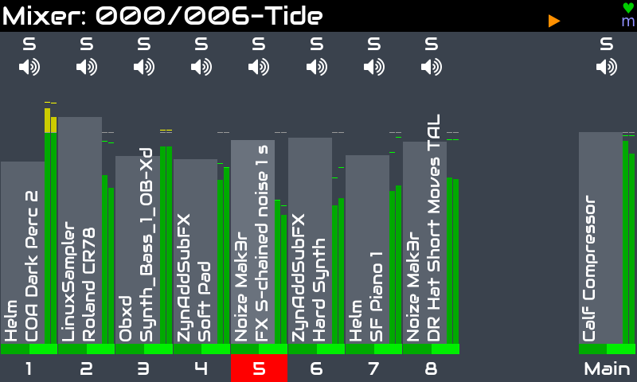
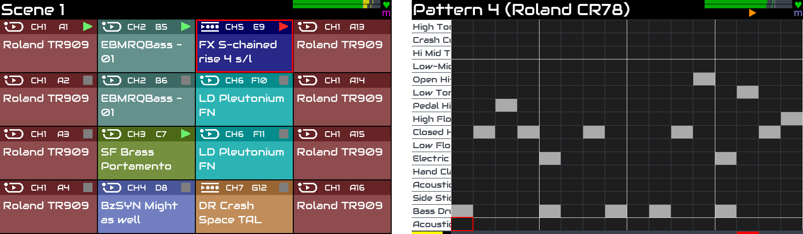

Zynthian is a powerful tool for live-production and fast song-prototyping. It includes more than 30 synth-engines, hundreds of effects and thousands of presets. It's fully multitimbral, being able to manage up to 16 independent chains including synthesizers, midi processors and audio effects. It supports the LV2-plugin standard, so the list of engines FXs & processors is ever growing.

[figure class=""][/figure]

It features a step-sequencer with live-performing and song composing modes. The pads interface allows to launch and stop sequences in real-time, having several syncing modes, one-time, loops, etc. The arranger interface manages linear composing.

[figure class=""][/figure]

Super-easy midi-learning, rule-based midi-filter, multi-track audio recorder, audio sampler, midi file recorder & player, customized audio & midi routing. PureData & MOD-UI are integrated too.

A growing list of supported midi controllers can be used to control zynthian without configuration, totally plug & play:
[Novation Launchpad, Akai APC, Akai MIDI Mix, ...](https://wiki.zynthian.org/index.php/Supported_MIDI_controllers) 

Zynthian can also be controlled from DAWs and external sequencers. It has standard MIDI-IN/OUT/THRU connectors, 4 USB ports, WIFI and wired networks, supporting MIDI over network: Apple/RTP-MIDI, IP-multicast and TouchOSC protocols. 

Default latency and jitter is low enough for most use-cases, but if you are looking for extra-low latency, audio configuration can be tweaked.

Read the full specifications [here](/technical-specifications).

<!--
<small>Trip Jazz Demo, by Humi</small>

<small>BlueBox is Roughly Great, by Nicolaz</small>

<small>RTPMidi Celebration, by JTunes</small>

<small>Epic EnteR, by R.Generalov</small>

<small>Electro, by Humi</small>

<small>Mr Tchaikovsky, by sm7x7</small>

<small>Of Course My Lord, by R.Generalov</small>

<small>First Real Synth, by Can Trell</small>

<small>For Wyleu, by Humi</small>

-->

